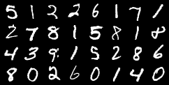
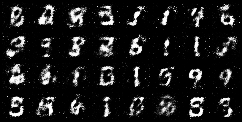

# GANs
April 2024 project on GANs

---
In order to visualize data run in the terminal:
`tensorboard --logdir=logs50 --port=6006`

  
  

Above an example of dataset (left side) and an example of generated data (right side).

